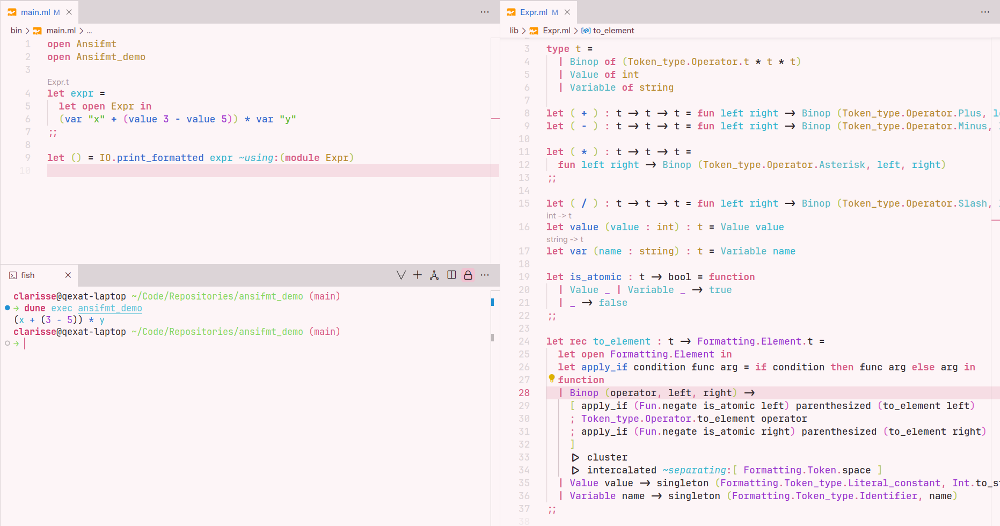

# ansifmt demo

A very simple project that makes use of [`ansifmt`](https://opam.ocaml.org/packages/ansifmt/)'s tokenization-based formatting.

> Theme: [Rosalie](https://github.com/qexat/rosalie)

> Theme: [Kalmia](https://github.com/qexat/kalmia-theme)
